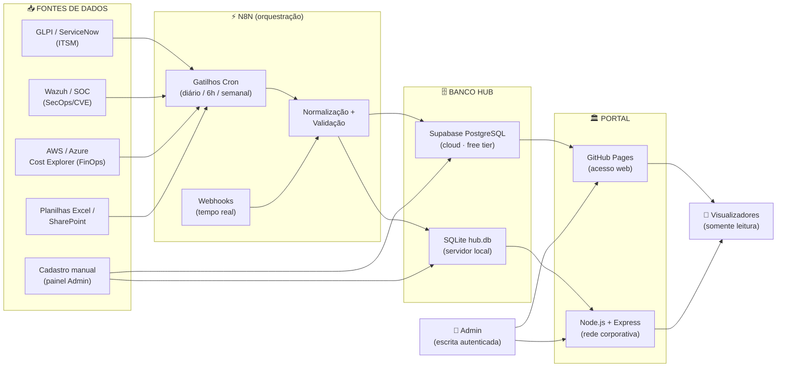
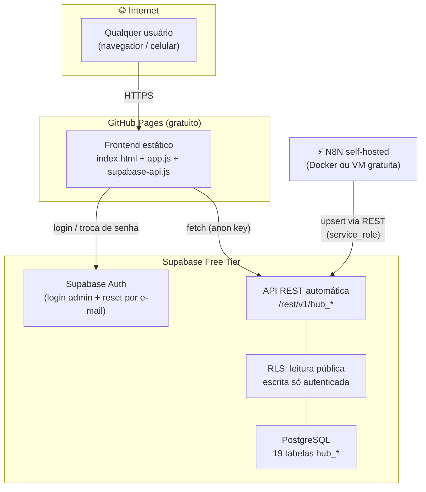
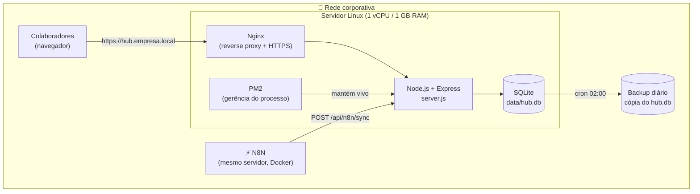
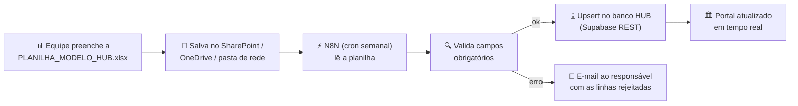
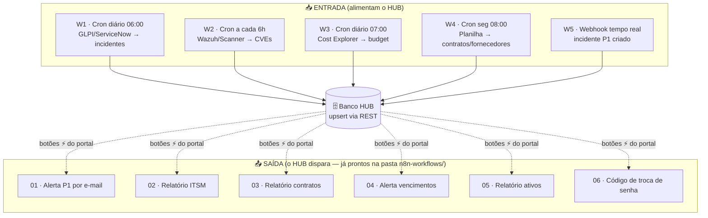
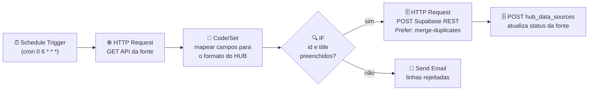

# 📘 HUB GOV TI v2 — Manual de Implantação e Alimentação de Dados

> Documento oficial de operação: arquitetura, dicionário de dados de todas as abas,
> planilhas de carga, instalação corporativa (cloud e servidor) e gatilhos N8N.
>
> Portal: https://wandersontech83.github.io/hub-gov-ti-v2/ · Versão 2.0 · Junho/2026

---

## Índice

1. [Arquitetura da solução](#1-arquitetura-da-solução)
2. [Como alimentar cada aba — dicionário de dados](#2-como-alimentar-cada-aba--dicionário-de-dados)
3. [Planilha modelo de carga](#3-planilha-modelo-de-carga)
4. [Instalação em ambiente corporativo](#4-instalação-em-ambiente-corporativo)
5. [N8N — gatilhos e workflows](#5-n8n--gatilhos-e-workflows)
6. [Operação e manutenção](#6-operação-e-manutenção)

---

## 1. Arquitetura da solução

### 1.1 Visão geral — fluxo de dados



### 1.2 Arquitetura CLOUD (em produção hoje — custo zero)



| Componente | Serviço | Custo |
|---|---|---|
| Frontend | GitHub Pages | R$ 0 |
| Banco + Auth + API | Supabase free tier (500 MB) | R$ 0 |
| Orquestração | N8N self-hosted | R$ 0 |

### 1.3 Arquitetura SERVIDOR CORPORATIVO (on-premise)



### 1.4 Modelo de acesso

| Perfil | Autenticação | Permissões |
|---|---|---|
| **Visualizador** | nenhuma (link) | Lê todos os dashboards, gráficos, Copilot |
| **Admin** | senha (sessão 15 min, bloqueio 5 tentativas) | Cria/edita registros, módulos, N8N, exporta Excel |

- A aba **⚙️ Configurações só aparece para o Admin logado**
- Senha protegida com hash; troca exige **validação por e-mail**
- Na cloud, a escrita é bloqueada **no banco** (RLS) — não apenas na interface

---

## 2. Como alimentar cada aba — dicionário de dados

Cada aba do portal lê uma ou mais tabelas. Três vias de alimentação:

1. **🖱️ Manual** — botões "➕ Novo" no painel Admin (bom para poucos registros)
2. **📊 Planilha** — preencher a [planilha modelo](PLANILHA_MODELO_HUB.xlsx) e importar via N8N
3. **⚡ Automático** — N8N puxando das ferramentas (GLPI, Wazuh, AWS…) — seção 5

### Mapa aba → tabela

| Aba do portal | Tabela(s) | Alimentação típica |
|---|---|---|
| 📊 Visão Geral | *derivada de todas* | automática (KPIs calculados) |
| 🚨 ITSM | `hub_incidents`, `hub_problems`, `hub_rfcs`, `hub_cab_meetings` | N8N ← GLPI/ServiceNow |
| 🔄 Mudanças & CAB | `hub_rfcs`, `hub_cab_meetings` | manual ou N8N |
| 📋 Contratos | `hub_contracts` | planilha (gestão de contratos) |
| 🤝 Fornecedores | `hub_suppliers` | planilha |
| 💰 Budget / 📈 FinOps | `hub_budget_entries` | planilha mensal ou N8N ← Cost Explorer |
| 🔥 Riscos | `hub_risks` | manual (comitê de riscos) |
| ✅ Compliance / 📁 Auditoria | `hub_evidences`, `hub_audit_actions` | manual + planilha |
| 🔐 Segurança & IAM | `hub_vulnerabilities`, `hub_pam_accounts` | N8N ← Wazuh/scanner |
| 🤖 Gov. IA | `hub_ai_models` | manual |
| ⏱️ SLA Monitor | `hub_incidents` (abertos) + `hub_sla_records` (histórico) | N8N ← ITSM |
| 🎯 OKRs de TI | `hub_okrs`, `hub_key_results` | manual (ciclo trimestral) |
| 🔌 Fontes de Dados / 🗺️ Mapeamento | `hub_data_sources` | N8N (auto-atualiza ao sincronizar) |
| 📜 Histórico / Alertas | `hub_activity_log`, `hub_alerts` | automática |
| 🚀 PMO / 🧩 CMDB / 🖥️ Ativos / 🛡️ Continuidade / 🛰️ ITOM | demonstrativas nesta versão | evolução futura |

### 2.1 Incidentes — `hub_incidents` (abas ITSM e SLA Monitor)

| Campo | Tipo | Obrig. | Exemplo | Observação |
|---|---|---|---|---|
| id | texto | ✓ | INC-2031 | chave única (upsert usa este campo) |
| title | texto | ✓ | ERP indisponível | |
| priority | P1–P4 | ✓ | P1 | P1 = crítico |
| category | texto | | Infraestrutura | Rede, Aplicação, Acesso… |
| status | texto | ✓ | Aberto | Aberto, Em andamento, Aguardando, Resolvido |
| assignee | texto | | Carlos Mendes | |
| team | texto | | Service Desk | usado no ranking SLA |
| sla_limit | data-hora ISO | | 2026-06-15T18:00:00Z | o countdown colorido usa este campo |
| created_at | data-hora ISO | ✓ | 2026-06-15T14:00:00Z | |
| description | texto | | … | |
| rca | texto | | … | causa raiz (pós-resolução) |

### 2.2 Contratos — `hub_contracts`

| Campo | Tipo | Obrig. | Exemplo |
|---|---|---|---|
| id | texto | ✓ | CTR-2026-001 |
| title | texto | ✓ | Microsoft 365 E5 — 1.200 licenças |
| supplier | texto | ✓ | Microsoft *(igual ao nome em Fornecedores)* |
| type | CAPEX/OPEX | ✓ | OPEX |
| value | número | ✓ | 1980000 *(R$ sem pontos)* |
| start_date / end_date | data ISO | ✓ | 2026-01-01 / 2027-01-01 |
| renewal | texto | | Automática anual |
| responsible | texto | | Fernanda Dias |
| scope | texto | | Licenciamento produtividade… |
| status | texto | ✓ | Ativo, Vencendo, Em renegociação, Encerrado |

### 2.3 Fornecedores — `hub_suppliers`

| Campo | Exemplo | Observação |
|---|---|---|
| name | Microsoft | precisa bater com `supplier` dos contratos |
| segment | Cloud & Produtividade | |
| contracts | 3 | nº de contratos vigentes |
| total_value | 3850000 | R$ |
| sla_pct | 99.9 | % de SLA contratual cumprido |
| status | Ativo / Em renegociação | |
| is_critical | 1 ou 0 | fornecedor crítico? |
| contact_email | enterprise@microsoft.com | |

### 2.4 Budget — `hub_budget_entries` (uma linha por torre × mês × categoria)

| Campo | Exemplo | Observação |
|---|---|---|
| category | OPEX ou CAPEX | |
| tower | Infraestrutura | Aplicações, Segurança, Dados & IA, Service Desk, Cloud |
| planned | 200000 | planejado do mês (R$) |
| realized | 187000 | realizado do mês (0 para meses futuros) |
| month / year | 6 / 2026 | |

> 💡 12 meses × 6 torres × 2 categorias = 144 linhas/ano. A planilha modelo já vem com a grade montada.

### 2.5 Riscos — `hub_risks`

| Campo | Exemplo | Observação |
|---|---|---|
| code | RSC-007 | exibido na matriz |
| description | Vazamento de dados (LGPD) | |
| category | Segurança | Continuidade, Financeiro, Fornecedores, IA, Tecnologia |
| probability / impact | 3 / 5 | escala 1–5 (posiciona na matriz) |
| kri_score | 81 | 0–100 |
| status | Mitigando | Ativo, Mitigando, Aceito |
| mitigation_plan | DLP + revisão de acessos… | |

### 2.6 OKRs — `hub_okrs` + `hub_key_results`

**hub_okrs:** title, cycle (Q3 2026), area, strategic_alignment, current_pct (0–100), status.
**hub_key_results:** okr_id (nº do objetivo), description, target (meta), current (atual), responsible, progress_pct, status.

### 2.7 Auditoria — `hub_evidences` + `hub_audit_actions`

**Evidências:** framework (ISO 27001, ISO 42001, LGPD, COBIT), domain, control, type (Política, Relatório, Print de tela, Ata, Log, Certificado), responsible, collected_at, **expires_at** (controla os status Válida/Vencendo/Vencida), approver.
**Planos de ação:** gap, framework, criticality (Alta/Média/Baixa), responsible, deadline, completion_pct.

### 2.8 Segurança — `hub_vulnerabilities` + `hub_pam_accounts`

**Vulnerabilidades:** id (CVE-2026-12345), asset, cvss (0–10), severity (Crítica/Alta/Média), status, deadline.
**Contas PAM:** username, profile, system, last_login, mfa (1/0), rotation_days.

### 2.9 Gov. IA — `hub_ai_models`

name, type, status (Produção/Homologação), risk_level (Alto/Médio/Baixo), tokens_month, lgpd_ok (1/0), ethics_approved (1/0).

---

## 3. Planilha modelo de carga

📊 **[PLANILHA_MODELO_HUB.xlsx](PLANILHA_MODELO_HUB.xlsx)** — uma aba por tabela, cabeçalhos prontos e 2 linhas de exemplo em cada (apague os exemplos e preencha).

### Fluxo de carga via planilha



**Regras de preenchimento:**
- Datas: `AAAA-MM-DD` (ou `AAAA-MM-DDTHH:MM:SSZ` com hora)
- Valores: números puros, sem `R$`, pontos ou vírgulas de milhar
- Campos `id`/`code`: são a chave do upsert — reenviar a planilha **atualiza** em vez de duplicar
- Sim/Não: `1` / `0`

---

## 4. Instalação em ambiente corporativo

### 4.1 Opção A — Cloud gratuita (a que está em produção)

| Passo | Ação | Ferramenta |
|---|---|---|
| 1 | Criar projeto no Supabase (free) | supabase.com |
| 2 | Rodar `setup.sql` no SQL Editor | painel Supabase |
| 3 | Criar usuário admin (Auth → Add user, Auto Confirm) | painel Supabase |
| 4 | Ajustar `supabase-config.js` (URL, anon key, e-mail) | repositório |
| 5 | Publicar no GitHub Pages (Settings → Pages → main) | github.com |
| 6 | Definir Site URL no Auth (link de troca de senha) | painel Supabase |

**Indicada para:** acesso de qualquer lugar, custo zero, sem servidor para manter.
**Atenção:** free tier pausa após ~1 semana sem uso (reativa em 1 clique); dados ficam na nuvem Supabase (avaliar política de dados da empresa).

### 4.2 Opção B — Servidor corporativo Linux (dados 100% internos)

```bash
# 1. Node.js LTS
curl -fsSL https://deb.nodesource.com/setup_22.x | sudo -E bash -
sudo apt-get install -y nodejs

# 2. Aplicação
sudo git clone https://github.com/Wandersontech83/hub-gov-ti-v2-local /opt/hub-gov-ti
cd /opt/hub-gov-ti && npm install --omit=dev

# 3. PM2 (processo permanente + boot)
sudo npm install -g pm2
ADMIN_PASSWORD='senha-forte' SESSION_SECRET='string-aleatoria-longa' \
  pm2 start server.js --name hub-gov-ti
pm2 save && pm2 startup

# 4. Nginx (HTTPS + proxy)
sudo apt-get install -y nginx certbot python3-certbot-nginx
# criar /etc/nginx/sites-available/hub-gov-ti:
#   server { server_name hub.empresa.com.br;
#     location / { proxy_pass http://127.0.0.1:3000; proxy_set_header Host $host; } }
sudo ln -s /etc/nginx/sites-available/hub-gov-ti /etc/nginx/sites-enabled/
sudo nginx -t && sudo systemctl reload nginx
sudo certbot --nginx -d hub.empresa.com.br

# 5. Backup diário (cron 02:00) — backup = copiar 1 arquivo
echo '0 2 * * * cp /opt/hub-gov-ti/data/hub.db /backups/hub_$(date +\%F).db' | crontab -
```

**Requisitos mínimos:** 1 vCPU, 1 GB RAM, 10 GB disco (o app usa ~50 MB RAM e ~16 MB disco).
**Firewall:** liberar 443 (usuários) e 5678 (N8N, se no mesmo servidor) na rede interna.

### 4.3 Opção C — Docker (servidor ou VM cloud corporativa)

```yaml
# docker-compose.yml
services:
  hub:
    image: node:22-slim
    working_dir: /app
    volumes: [ "./hub-gov-ti:/app", "hub-data:/app/data" ]
    command: sh -c "npm install --omit=dev && node server.js"
    environment:
      - ADMIN_PASSWORD=${ADMIN_PASSWORD}
      - SESSION_SECRET=${SESSION_SECRET}
    ports: [ "3000:3000" ]
    restart: unless-stopped

  n8n:
    image: docker.n8n.io/n8nio/n8n
    ports: [ "5678:5678" ]
    volumes: [ "n8n-data:/home/node/.n8n" ]
    environment:
      - GENERIC_TIMEZONE=America/Sao_Paulo
    restart: unless-stopped

volumes: { hub-data: {}, n8n-data: {} }
```

### 4.4 Checklist de segurança (qualquer opção)

- [ ] Trocar `ADMIN_PASSWORD` e `SESSION_SECRET` (nunca usar padrão)
- [ ] HTTPS obrigatório (certbot ou certificado corporativo)
- [ ] Backup automático testado (restaurar 1× por trimestre)
- [ ] N8N atrás de autenticação (`N8N_BASIC_AUTH_ACTIVE=true`)
- [ ] service_role do Supabase **somente** no N8N — nunca no frontend
- [ ] Revisar trimestralmente os tokens de acesso (Supabase → Account → Tokens)

---

## 5. N8N — gatilhos e workflows

### 5.1 Mapa geral



### 5.2 Gatilhos de ENTRADA a criar

| # | Gatilho | Frequência | Fonte | Destino (tabela) |
|---|---|---|---|---|
| W1 | Schedule (Cron) | diário 06:00 | API GLPI / ServiceNow | `hub_incidents`, `hub_sla_records` |
| W2 | Schedule (Cron) | a cada 6 h | API Wazuh / scanner de vulns | `hub_vulnerabilities` |
| W3 | Schedule (Cron) | diário 07:00 | AWS/Azure Cost API | `hub_budget_entries` (realized) |
| W4 | Schedule (Cron) | segunda 08:00 | PLANILHA_MODELO_HUB.xlsx (SharePoint) | `hub_contracts`, `hub_suppliers`, `hub_risks`, `hub_okrs`… |
| W5 | Webhook | tempo real | ITSM (regra "se P1, chamar webhook") | `hub_incidents` + alerta imediato |

### 5.3 Anatomia de um workflow de entrada (padrão para todos)



**Nó de gravação (igual em todos os workflows de entrada):**

```
Método:  POST
URL:     https://eqvyklhrpkooytykebmu.supabase.co/rest/v1/hub_incidents
Headers: apikey: <SERVICE_ROLE_KEY>          ← Supabase → Settings → API
         Authorization: Bearer <SERVICE_ROLE_KEY>
         Content-Type: application/json
         Prefer: resolution=merge-duplicates  ← upsert (não duplica)
Body:    [ { "id": "INC-2031", "title": "...", "priority": "P1",
             "status": "Aberto", "created_at": "2026-06-15T14:00:00Z" } ]
```

> Para a versão servidor local, o destino muda para
> `POST https://hub.empresa.com.br/api/n8n/sync` com corpo
> `{ "entity": "incidents", "records": [ ... ] }` e header `X-N8N-API-KEY`.

### 5.4 Exemplo de mapeamento (nó Code) — GLPI → HUB

```javascript
// W1: transforma o retorno do GLPI no formato hub_incidents
return $input.all().map(item => {
  const t = item.json;
  return { json: {
    id:         `INC-${t.id}`,
    title:      t.name,
    priority:   { 6:'P1', 5:'P1', 4:'P2', 3:'P3', 2:'P4', 1:'P4' }[t.priority] || 'P3',
    category:   t.itilcategories_name || 'Geral',
    status:     { 1:'Aberto', 2:'Em andamento', 4:'Aguardando', 5:'Resolvido', 6:'Resolvido' }[t.status] || 'Aberto',
    assignee:   t.users_id_assign_name || '',
    team:       t.groups_id_assign_name || 'Service Desk',
    created_at: new Date(t.date_creation).toISOString(),
    sla_limit:  t.time_to_resolve ? new Date(t.time_to_resolve).toISOString() : null,
    description: (t.content || '').replace(/<[^>]+>/g, '').slice(0, 800)
  }};
});
```

### 5.5 Workflows de SAÍDA (já prontos)

A pasta [`n8n-workflows/`](https://github.com/Wandersontech83/hub-gov-ti-v2) do projeto local contém 6 workflows prontos para importar (**N8N → menu ⋮ → Import from file**):
alerta P1, relatório ITSM, relatório de contratos, alerta de vencimentos, relatório de ativos e **código de troca de senha** (webhook `reset-senha`).
Depois de importar: configurar as credenciais SMTP no nó de e-mail e **ativar** cada workflow. No portal, em ⚙️ Configurações, informar a URL base do N8N.

---

## 6. Operação e manutenção

| Rotina | Frequência | Como |
|---|---|---|
| Acessar o portal (mantém o free tier ativo) | semanal | abrir o link |
| Backup (cloud) | mensal | Supabase → Database → Backups (automático no free: 7 dias) |
| Backup (servidor) | diário | cron copiando `hub.db` |
| Revisar evidências vencendo | mensal | aba 📁 Auditoria → Painel |
| Atualizar OKRs | quinzenal | aba 🎯 OKRs → Configurar (admin) |
| Trocar senha admin | trimestral | botão 🔁 no login (validação por e-mail) |
| Revisar tokens e chaves | trimestral | painel Supabase |

**Suporte / problemas comuns**

| Sintoma | Causa provável | Solução |
|---|---|---|
| "Could not find the table" | projeto Supabase pausado | abrir o painel e clicar Restore |
| Login admin falha | senha trocada / usuário ausente | usar "Trocar / esqueci a senha" |
| Dados não atualizam | N8N parado ou credencial vencida | verificar execuções no N8N |
| Site fora do ar | build do GitHub Pages | repositório → Actions/Pages |

---

*Documento gerado para o projeto HUB GOV TI v2 — arquitetura, dados e integrações.*
